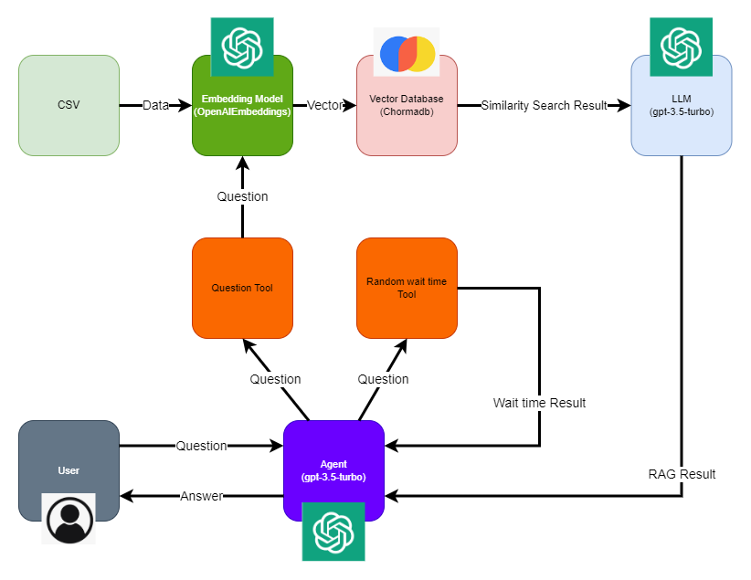

# Agent_Rag_Chatbot
This is a chatbot using agent tool and one of the tool is using Retrieval-Augmented Generation from a vector database.

## Design Diagram
<div align="center"></div>

## Prequisite
Python must be installed

Obtained your own openai_ai_key

## Quick Start
Use CMD

Clone the repository
```
git clone https://github.com/honshinglo/agent_rag_chatbot.git
cd agent_rag_chatbot
```

Create a .env file for the OPENAI_API_KEY (Please use your own key)
```
chcp 65001
echo OPENAI_API_KEY=sk-proj-xxxxxxxxxxxxxxxxxxxxxxxxxxxxxxxx > .env
```

Create a virtual environment
```
python -m venv venv
.\venv\Scripts\activate
```

Install the Packages
```
pip install -r requirements.txt
```

Embedding the data and store it in the vector store chromadb
```
.\venv\Scripts\python.exe .\etl.py
```

Run the program using streamlit
```
streamlit run .\fronend.py
```
